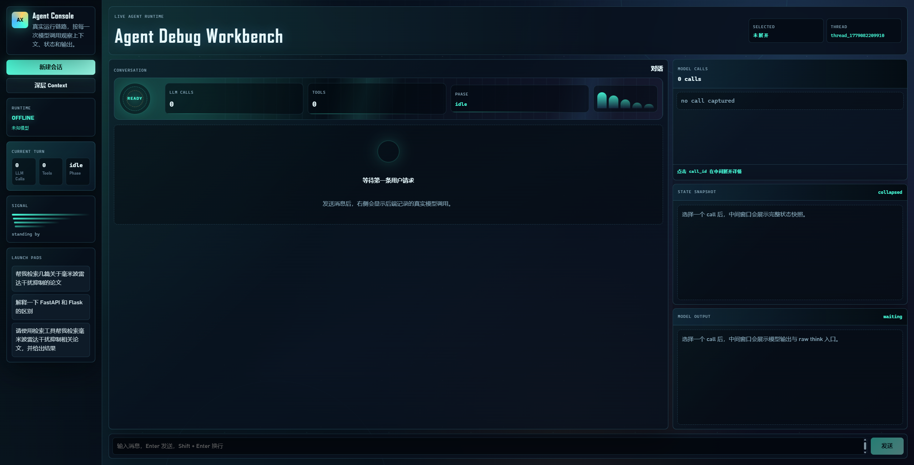
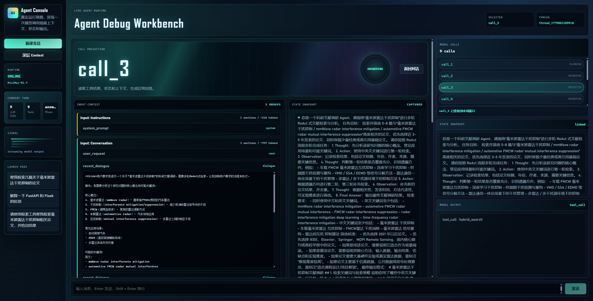
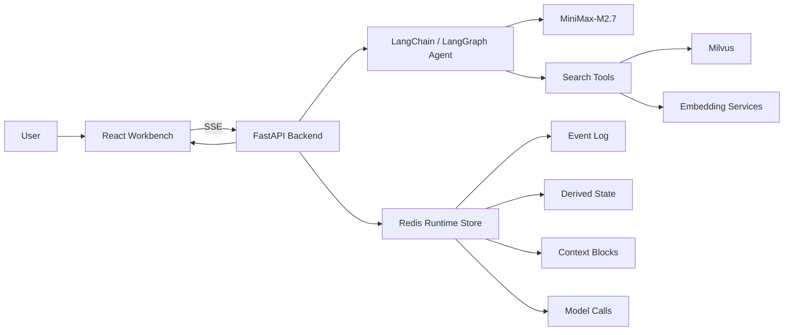

# Agent Workbench

把 Agent 的黑箱运行过程，变成可观察、可解释、可复盘的执行轨迹。

[在线体验](https://zhaiyuan-ji.github.io/Agent_System/) · [快速开始](#本地运行) · [项目结构](#项目结构)

Agent Workbench 是一个面向 Agent 学习、调试和演示的可视化平台。它不仅展示最终回答，还会把一次 Agent 运行拆成多个可检查的步骤：模型调用、工具调用、上下文装配、状态变化和最终输出。

如果你正在学习 RAG、LangGraph、工具调用、上下文工程，或者想向别人讲清楚“Agent 到底是怎么工作的”，这个项目可以作为一个完整的参考样例。

```text
用户请求 -> 模型调用 -> 工具调用 -> 状态更新 -> 上下文装配 -> 最终回答
```

## 在线体验

无需安装本地环境，直接打开：

[https://zhaiyuan-ji.github.io/Agent_System/](https://zhaiyuan-ji.github.io/Agent_System/)

你可以在浏览器里发送一条问题，然后观察右侧出现的 `call_1`、`call_2`、`call_3`。点击任意一次调用，中间窗口会展示该次调用的上下文、状态快照和模型输出。

## 界面预览

### 全局工作台



首页采用运行数据控制台布局。左侧显示线程、模型和运行状态；中间保留正常对话体验；右侧提供 `Model Calls`、`State Snapshot`、`Model Output` 三个观察入口。用户既可以像使用普通 AI 产品一样对话，也可以随时切换到调试视角。

### 模型调用投影



选中某一次模型调用后，中间窗口会切换为调用详情。你可以看到该次调用使用了哪些输入上下文、当时的状态是什么、模型输出了工具调用还是最终回答。这种 call-level 视角让 Agent 的运行过程不再停留在“猜测”层面。

## 核心优势

| 能力 | 价值 |
| --- | --- |
| 模型调用可视化 | 每一次 LLM 调用都有独立编号和详情，便于复盘复杂 Agent 行为 |
| 上下文分层展示 | 将 system prompt、用户请求、历史对话、工具证据和状态快照拆开显示 |
| 渐进式披露 | 默认保持界面清爽，需要调试时再逐层展开完整内容 |
| 工具调用追踪 | 展示 Agent 何时调用工具、调用了什么工具、工具结果如何进入后续回答 |
| 状态快照 | 将任务目标、约束、证据和开放问题沉淀为结构化状态 |
| 教学友好 | 适合用于讲解 Agent、RAG、Context Engineering 和 LangGraph 执行流程 |

## 适合谁

- 正在学习 Agent 系统设计的开发者
- 想理解 LangChain / LangGraph 运行机制的工程师
- 需要演示 RAG 与工具调用链路的老师或讲者
- 想研究上下文压缩、状态管理和 prompt assembly 的开发者
- 想做 Agent 产品原型但不满足于普通聊天 UI 的团队

## 它解决什么问题

很多 Agent 项目只展示最终回答，隐藏了中间过程。这样很难回答几个关键问题：

- 模型这一轮到底看到了什么？
- 工具调用是怎么被触发的？
- 工具结果有没有真正进入下一次模型调用？
- 历史消息、memory、状态和证据是如何参与回答的？
- 为什么同一个问题在不同轮次会产生不同执行路径？

Agent Workbench 的设计目标就是把这些过程显式化。它将一轮请求拆成可观察的运行记录，让调试、教学和复盘都更直接。

## Model Call Inspector

`Model Call Inspector` 是项目的核心交互。

每一次真实模型调用都会记录为一个 `ModelCallRecord`，并在界面上显示为 `call_1`、`call_2`、`call_3`。点击某个 call 后，可以查看：

- `Input Context`：模型调用前被装配进去的上下文
- `State Snapshot`：该次调用前后的任务状态
- `Model Output`：模型输出、工具调用或最终回答
- `Raw Think`：深层调试信息，默认折叠

上下文以“大块 -> 小块”的方式组织：

```text
Input: Instructions
  -> system_prompt

Input: Conversation
  -> user_request
  -> recent_dialogue
  -> memory

Input: Tool Evidence
  -> tool_message
  -> evidence
```

这种结构比直接展示一整段 prompt 更适合学习和排错。

## 系统架构



## 功能概览

### Agent 执行链路

- 基于 LangChain / LangGraph 构建 Agent 执行流程
- 支持流式输出
- 支持工具调用事件记录
- 支持模型调用记录和回放

### Context Workbench

- 将上下文拆成可解释的 Context Blocks
- 记录每次上下文装配结果
- 展示被选中的上下文块和状态快照
- 支持深层展开完整内容

### Research Tools

项目内置两个检索工具，用于演示真实 RAG 场景下的工具调用：

- `hybrid_search`：结合 dense vector、sparse vector 和 RRF 的混合检索
- `filtered_search`：按作者、年份、标题关键词、摘要关键词进行条件过滤

## 技术栈

| 层级 | 技术 |
| --- | --- |
| 前端 | React 18, TypeScript, Vite |
| 后端 | FastAPI, Uvicorn, Server-Sent Events |
| Agent Runtime | LangChain, LangGraph |
| 默认模型 | MiniMax-M2.7 |
| 模型接口 | OpenAI-compatible API |
| 向量数据库 | Milvus |
| 运行时存储 | Redis |
| 检索方式 | Dense Vector + Sparse Vector + RRF |

## 本地运行

### 环境要求

- Python 3.10+
- Node.js 18+
- Redis
- Milvus
- Dense embedding service
- Sparse embedding service

本项目当前开发环境默认使用：

```text
D:\Anaconda\envs\jzy\python.exe
```

### 配置模型

在仓库根目录创建 `.env.local`：

```env
OPENAI_API_KEY=your_api_key
OPENAI_BASE_URL=https://api.minimaxi.com/v1
OPENAI_MODEL=MiniMax-M2.7
```

`.env.local` 已被 `.gitignore` 忽略，请不要提交真实 API Key。

### 启动完整项目

安装前端依赖：

```powershell
cd Front_end
npm install
cd ..
```

启动前后端：

```powershell
D:\Anaconda\envs\jzy\python.exe .\start_app.py
```

访问：

```text
http://127.0.0.1:5173
```

后端健康检查：

```powershell
Invoke-WebRequest -UseBasicParsing http://127.0.0.1:8000/api/health
```

## 开发命令

运行测试：

```powershell
D:\Anaconda\envs\jzy\python.exe -m unittest discover -v
```

构建前端：

```powershell
cd Front_end
npm run build
```

启动前端开发服务：

```powershell
cd Front_end
npm run dev
```

## 项目结构

```text
Agent_System/
├── Agent/                 # Agent 创建、系统提示词、工具挂载
├── Back_end/              # FastAPI 服务和 SSE 接口
├── Context/               # 事件、状态、上下文、模型调用记录
├── Front_end/             # React Workbench 前端
├── RAG/                   # Milvus schema 和数据导入逻辑
├── Tool/                  # hybrid_search / filtered_search
├── Sglang/                # 本地模型和 embedding 服务参考脚本
├── tests/                 # 测试
├── picture/               # README 截图
├── start_app.py           # 一键启动脚本
└── README.md
```

## 推荐阅读顺序

如果你想通过这个项目学习 Agent 系统，可以按下面顺序阅读源码：

1. `Back_end/api_server.py`：理解 SSE 如何把运行过程推给前端。
2. `Agent/agent.py`：理解 LangChain / LangGraph 如何挂载模型和工具。
3. `Context/middleware.py`：理解每次模型调用如何被捕获。
4. `Context/context_service.py`：理解状态、上下文和装配记录如何暴露给前端。
5. `Front_end/src/App.tsx`：理解 Workbench 如何展示对话和 Inspector。
6. `Tool/Hybrid_Search_Tool.py`：理解检索工具如何连接 embedding 服务和 Milvus。

## License

MIT License
