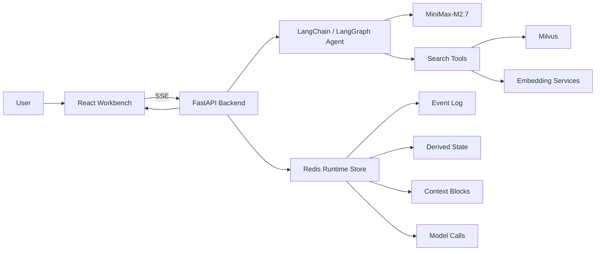

# Agent Workbench

一个用于学习、演示和调试 Agent 运行过程的可视化平台。

**在线体验：** [打开 Agent Workbench Demo](https://zhaiyuan-ji.github.io/Agent_System/)

它保留了“学术检索 Agent”这个真实场景，但重点不是再做一个聊天机器人，而是把一次 Agent 运行中最关键、最难理解的部分展示出来：

```text
用户问题 -> 模型调用 -> 工具调用 -> 状态更新 -> 上下文装配 -> 最终回答
```

如果你想知道 Agent 到底看到了什么上下文、为什么决定调用工具、工具结果如何影响状态、模型最终基于什么生成答案，这个项目就是为这个问题准备的。

## 界面预览

### 等待态：Agent 控制台


第一张图展示的是平台的默认工作台形态：左侧是运行控制台，中间是正常对话窗口，右侧是 `Model Calls / State Snapshot / Model Output` 三个调试入口。这个状态下还没有用户请求，界面重点是让访客先理解“这不是普通聊天页，而是一个按模型调用观察 Agent 的控制台”。

### 运行态：选中某一次模型调用


第二张图展示的是选中 `call_3` 后的状态：中间窗口从普通对话切换成该次模型调用的投影视图，可以看到 `Input Context`、`State Snapshot` 和 `Model Output`。这正是项目的核心体验：一轮回答不是一个黑盒，而是由多次可检查、可回放的模型调用组成。

## 项目亮点

| 能力 | 说明 |
| --- | --- |
| 真实模型调用追踪 | 每一次 LLM 调用都会被记录为 `call_1`、`call_2`，不是前端假数据 |
| Model Call Inspector | 点击某次调用即可查看该次调用的上下文、状态快照和模型输出 |
| 渐进式披露 | 默认保持界面清爽，需要调试时再逐层展开 prompt、memory、tool message 和 raw think |
| Agentic 工具调用 | 后端不做关键词规则路由，是否调用工具由 Agent 自己决定 |
| 学术检索场景 | 内置论文混合检索和条件过滤检索，用真实 RAG 场景演示 Agent 行为 |
| 运行数据控制台 | 前端不是普通聊天页，而是面向学习和演示的 Agent Workbench |

## 在线 Demo

项目支持一个纯前端在线演示模式，README 顶部的在线体验链接指向：

```text
https://zhaiyuan-ji.github.io/Agent_System/
```

Demo 模式的目标不是替代真实后端，而是让访客可以通过一个公开网址快速体验 Workbench 的交互方式：

- 保留当前科幻风格前端界面和动画效果。
- 使用模拟的 `ModelCallRecord`、状态快照和工具调用结果。
- 不需要 Redis、Milvus、embedding 服务、后端服务或 API Key。
- 适合放在 GitHub README 顶部作为“Live Demo”入口。

本地运行 demo：

```powershell
cd Front_end
npm run dev:demo
```

构建静态 demo：

```powershell
cd Front_end
npm run build:demo
```

也可以在普通前端地址后追加 `?demo=1` 临时进入演示模式。

仓库内已经加入 GitHub Pages 自动部署配置：

```text
.github/workflows/demo-pages.yml
```

推送到 GitHub 后，Actions 会自动执行 `npm run build:demo`，并把 `Front_end/dist` 发布到 GitHub Pages。

如果要换成其他平台，只需要把 `Front_end` 作为静态前端项目部署，并使用：

| 平台 | 配置 |
| --- | --- |
| Vercel | Build Command: `npm run build:demo`，Output Directory: `dist` |
| Netlify | Build Command: `npm run build:demo`，Publish Directory: `dist` |
| GitHub Pages | 先执行 `npm run build:demo`，再发布 `Front_end/dist` |

如果部署平台需要环境变量，也可以显式设置：

```env
VITE_DEMO_MODE=true
```

## 它和普通 Agent Demo 有什么不同

普通 Demo 往往只展示“用户问了什么”和“模型答了什么”。
这个项目更关心中间过程。

你可以看到：

- 当前用户问题触发了几次模型调用。
- 每次模型调用前，后端装配了哪些上下文。
- Agent 是否决定调用工具，以及调用了哪个工具。
- 工具结果如何进入后续模型调用。
- 当前任务状态如何随着执行过程变化。
- 最终回答是如何从工具证据和上下文中生成的。

这使它更适合用作：

- Agent 系统教学项目
- LangChain / LangGraph 学习样例
- RAG 工具调用链路演示
- Context 管理和压缩策略实验平台
- Agent 前后端调试工作台

## 核心界面

前端采用桌面端 Workbench 布局：

| 区域 | 作用 |
| --- | --- |
| 左侧控制台 | 展示线程状态、模型信息、快捷问题和运行摘要 |
| 中间对话区 | 默认展示用户与 Agent 的正常对话，生成时自动跟随最新内容 |
| 右侧 Inspector | 展示 `Model Calls`、`State Snapshot`、`Model Output` |

当点击 `call_1`、`call_2` 时，中间区域会切换为该次模型调用详情。再次点击同一个 call，会回到普通对话视图。

## Model Call Inspector

`Model Call Inspector` 是这个项目最核心的调试入口。

每一次真实 LLM 调用都会被记录为一个 `ModelCallRecord`，其中包含：

- `call_id`：稳定编号，例如 `call_1`
- `phase`：当前调用所处阶段
- `purpose`：这次调用的目的
- `input_context`：这次调用前装配的上下文
- `state_snapshot`：调用前后的关键状态
- `output`：模型输出、工具调用或最终回答
- `raw_think`：可选的原始调试信息，默认折叠

上下文不是扁平地堆在一起，而是按“大块 -> 小块”的方式组织：

```text
Input: Instructions
  -> system_prompt

Input: Conversation
  -> user_request
  -> recent_dialogue
  -> memory

Input: Tool Evidence
  -> tool_message
  -> evidence
```

这种结构能让使用者先理解“有哪些上下文类别”，再逐层查看具体内容。

## 工具能力

### `hybrid_search`

混合学术检索工具。

- 使用 dense vector 捕捉语义相似度。
- 使用 sparse vector 捕捉关键词匹配。
- 使用 RRF 融合两路检索结果。
- 从 Milvus 返回论文标题、作者、年份、摘要和正文片段。

### `filtered_search`

条件过滤检索工具。

支持按作者、年份、年份范围、标题关键词、摘要关键词进行筛选，适合处理更精确的论文查找请求。

## 系统架构



## 技术栈

| 层级 | 技术 |
| --- | --- |
| 前端 | React 18, TypeScript, Vite |
| 后端 | FastAPI, Uvicorn, Server-Sent Events |
| Agent | LangChain, LangGraph |
| 默认模型 | MiniMax-M2.7 |
| 模型接口 | OpenAI-compatible API |
| 向量数据库 | Milvus |
| 运行时存储 | Redis |
| 检索方式 | Dense Vector + Sparse Vector + RRF |

## 项目结构

```text
Agent_System/
├── Agent/                 # Agent 创建、系统提示词、工具挂载
├── Back_end/              # FastAPI 服务和 SSE 接口
├── Context/               # 事件、状态、上下文、模型调用记录
├── Front_end/             # React Workbench 前端
├── RAG/                   # Milvus schema 和数据导入逻辑
├── Tool/                  # hybrid_search / filtered_search
├── Sglang/                # 本地模型和 embedding 服务参考脚本
├── tests/                 # 测试
├── output/                # 本地日志，已被 git 忽略
├── start_app.py           # 一键启动脚本
├── AGENTS.md              # 后续开发和重构约定
└── README.md
```

## 环境要求

推荐使用 Windows 本机环境运行。当前项目默认 Python 解释器为：

```text
D:\Anaconda\envs\jzy\python.exe
```

本地依赖服务：

| 服务 | 默认地址 |
| --- | --- |
| Redis | `localhost:6379` |
| Milvus | `localhost:19530` |
| Dense embedding service | `http://localhost:54331/v1` |
| Sparse embedding service | `http://localhost:54332/v1` |

默认应用端口：

| 服务 | 地址 |
| --- | --- |
| 后端 | `http://127.0.0.1:8000` |
| 前端 | `http://127.0.0.1:5173` |

## 配置

在仓库根目录创建 `.env.local`：

```env
OPENAI_API_KEY=your_api_key
OPENAI_BASE_URL=https://api.minimaxi.com/v1
OPENAI_MODEL=MiniMax-M2.7
```

注意：

- `.env.local` 已被 `.gitignore` 忽略，不要提交 API Key。
- 当前 MiniMax 调用链路不要传 `extra_body={"reasoning_split": True}`。
- 同一次 Chat Completions 请求中只保留一条真正的 `system` message。

## 快速开始

如果只是想看界面和交互，优先使用 demo 模式：

```powershell
cd Front_end
npm run dev:demo
```

如果要运行真实 Agent 链路，需要先准备 Redis、Milvus、embedding 服务和模型配置。

安装前端依赖：

```powershell
cd Front_end
npm install
cd ..
```

启动项目：

```powershell
D:\Anaconda\envs\jzy\python.exe .\start_app.py
```

访问前端：

```text
http://127.0.0.1:5173
```

检查后端：

```powershell
Invoke-WebRequest -UseBasicParsing http://127.0.0.1:8000/api/health
```

## 常用开发命令

运行测试：

```powershell
D:\Anaconda\envs\jzy\python.exe -m unittest discover -v
```

构建前端：

```powershell
cd Front_end
npm run build
```

手动启动后端：

```powershell
D:\Anaconda\envs\jzy\python.exe -m uvicorn Back_end.api_server:app --host 127.0.0.1 --port 8000
```

手动启动前端：

```powershell
cd Front_end
npm run dev
```

## SSE 事件

前端通过 SSE 消费后端运行事件：

| 事件 | 含义 |
| --- | --- |
| `text` | Agent 回答文本流 |
| `tool_call` | Agent 发起工具调用 |
| `tool_result` | 工具返回结果 |
| `runtime_event` | 执行阶段或运行事件 |
| `state_update` | 派生状态更新 |
| `context_assembly` | 上下文装配记录 |
| `model_call` | 真实 LLM 调用记录 |
| `error` | 错误事件 |
| `done` | 当前流结束 |

## 推荐阅读顺序

如果你想通过这个项目学习 Agent 系统，可以按下面顺序阅读源码：

1. `Back_end/api_server.py`：理解 SSE 如何把运行过程推给前端。
2. `Agent/agent.py`：理解 LangChain / LangGraph 如何挂载模型和工具。
3. `Context/middleware.py`：理解每次模型调用如何被捕获。
4. `Context/context_service.py`：理解状态、上下文和装配记录如何暴露给前端。
5. `Front_end/src/App.tsx`：理解 Workbench 如何展示对话和 Inspector。
6. `Tool/Hybrid_Search_Tool.py`：理解检索工具如何连接 embedding 服务和 Milvus。

## 当前边界

- 当前 UI 以桌面端演示为主。
- 学术检索能力依赖本地 Redis、Milvus 和 embedding 服务。
- `DerivedState`、`ContextBlock`、`AssemblyRecord` 目前主要用于调试展示和回放，后续仍可继续向更完整的 prompt assembly 层演进。
- 工具调用是 agentic 的，因此模型可能在某些请求中选择不调用工具。

## License

MIT License
